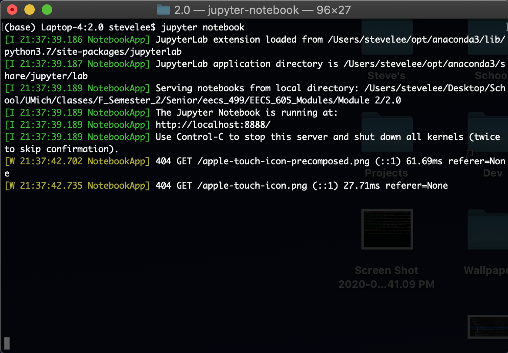
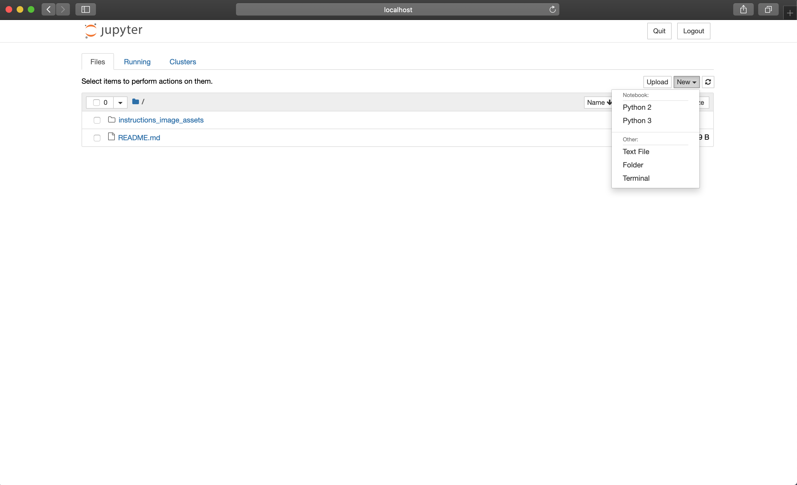
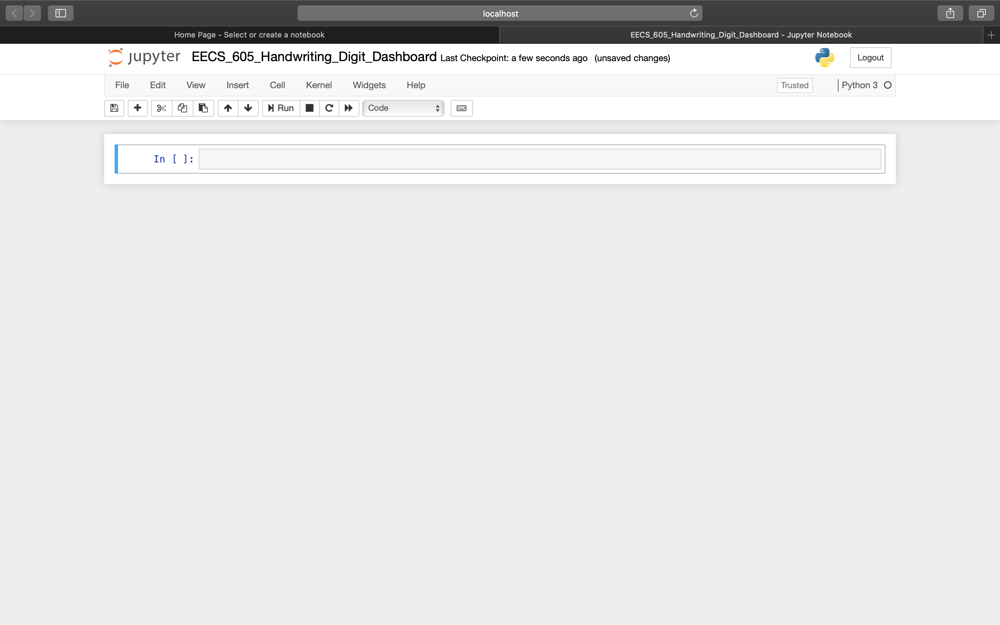
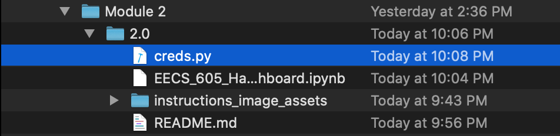
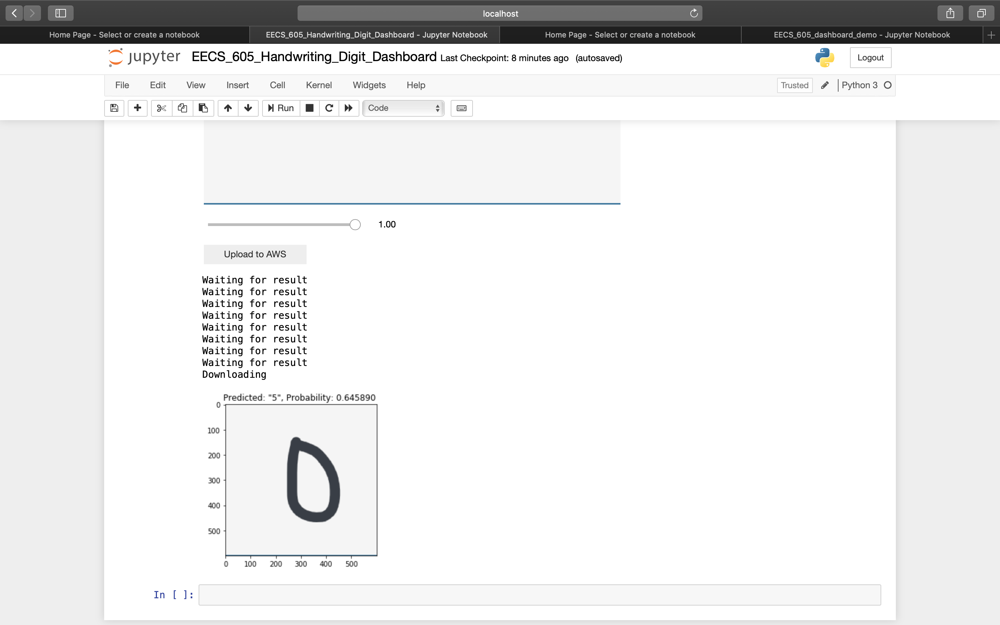

# Module 2.0
#### Goals
1. Implement encrypted AWS key into the Jupyter notebook and test to see if the Jupyter notebook is able to access AWS resources.
2. Create client-side application using Jupyter notebook that handles uploading handwritten digits (.png) to AWS, waits for results, downloads the results file, and presents it to the Jupyter notebook visually.
3. Deploy Jupyter notebook to Binder (MyBinder.org).

## Implement encrypted AWS key into the Jupyter noteobok
1. Within the "Module 2/2.0/" directory, start Jupyter server by running the command "jupyter notebook" in bash. Then create new Jupyter notebook that runs "Python 3" and name it. If you need brush-up on Jupyter, or if this is your first time using Jupyter, use this site to learn the basics: https://www.codecademy.com/articles/how-to-use-jupyter-notebooks.

2. This new Jupyter notebook environment is where we will create user-interactive dashboard with graphical user interface. Start by first copying creds.py from Module 1.1 into the "Module 2/2.0/" directory.

3. Write Python code (Not sure how to explain this step. Do we just give them the code or give them documentations to follow?)

4. Once code is completed, test the whole dashboard by running it from the beginning to the end.

5. Once the whole dashboard runs well, we will now deploy it to Binder, which is an online platform where Jupyter notebooks can become public for a fix amount of time (usually lasts around couple hours). Binder works by getting files and Jupyter notebook from a GitHub repository and does its own Binder-magic and automatically deploys it, which can be accessed by anyone in the world with a provided URL. To get started, first create a GitHub repository and 

5. Once the whole dashboard runs well, the next step is to modularize this dashboard (Module 2.1) so only the graphical-user-interfact (GUI) part is visible to the user. This is to make this dashboard distributable so you could send this to other people to test out.
# binder_test
